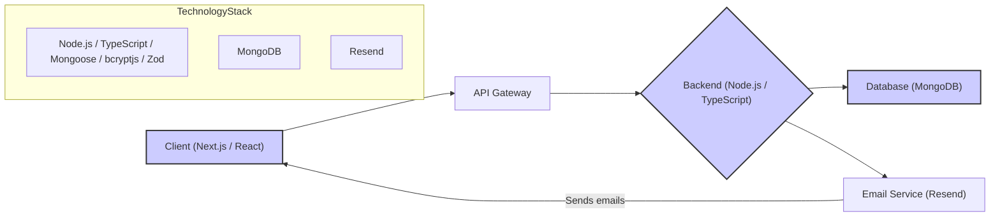

# TrueFeedback: A Full-Stack Feedback Management Web Application

[](LICENSE)
[](https://nextjs.org)
[](https://www.typescriptlang.org/)
[](https://www.npmjs.com/package/bcryptjs)
[](https://github.com/<YOUR_GITHUB_USERNAME>/truefeedback/actions)
[](https://codecov.io/gh/<YOUR_GITHUB_USERNAME>/truefeedback)

TrueFeedback is a full-stack web application built with Next.js and TypeScript, designed to streamline the feedback collection and management process for businesses and individuals.  It allows users to easily collect, analyze, and respond to feedback from various sources.

## Project Architecture



**Key Architectural Decisions:**

* Microservice architecture for scalability and maintainability.
* Type safety ensured through TypeScript.
* Secure password handling with bcryptjs.
* Data validation with Zod.

## Key Features

* **Feedback Collection:**  Collect feedback through various channels (e.g., forms, surveys, emails).
* **Feedback Analysis:** Analyze feedback data to identify trends and insights.
* **Response Management:**  Efficiently manage and respond to feedback.
* **User Authentication:** Secure user authentication and authorization.
* **Customizable Feedback Forms:** Create and customize feedback forms to fit specific needs.


## Technology Stack

* **Frontend:** Next.js 15.3.0, React 19.0.0, TypeScript 5, Tailwind CSS 4
* **Backend:** Node.js (using Next.js API routes), TypeScript 5, Mongoose 8.13.2
* **Database:** MongoDB
* **Authentication:** NextAuth.js 4.24.11
* **Email:** Resend 4.2.0
* **Password Hashing:** bcryptjs 3.0.2
* **Data Validation:** Zod 3.24.2


## Getting Started

### Prerequisites

* Node.js v16 or higher
* npm or yarn or pnpm or bun

### Installation

1. Clone the repository: `git clone <repository_url>`
2. Navigate to the project directory: `cd truefeedback`
3. Install dependencies: `npm install` (or `yarn`, `pnpm`, or `bun install`)

### Configuration

Create a `.env.local` file in the root directory and add your environment variables (e.g., database URI, email API keys).  Refer to the `.env.example` file for variable names and placeholders.

### Quick Start

1. Run the development server: `npm run dev`
2. Open [http://localhost:3000](http://localhost:3000) in your browser.

### Usage Examples

**Basic Feedback Submission (Illustrative):**  (Example will depend on the implemented UI/UX)

```javascript
// Placeholder -  Example would show how to submit feedback via a form or API endpoint
//  fetch('/api/feedback', {
//      method: 'POST',
//      body: JSON.stringify({ feedback: 'This is great!' })
//  })
```

## Detailed Usage Guide

**(This section will be significantly expanded to include comprehensive documentation on all features, API endpoints, and configuration options.  This is a placeholder.)**

* **Core Functionality:**  Detailed explanations of feedback submission, analysis, and response management.  
* **API Documentation:**  (Swagger/OpenAPI specification or similar)
* **Configuration Options:**  Detailed description of all configurable settings.


## Development & Contribution

### Development Setup

Follow the "Getting Started" instructions.

### Testing

(Include instructions on running tests and the testing framework used, e.g., Jest, React Testing Library)

### Code Style

We use ESLint with the `eslint-config-next` preset.  Run `npm run lint` to check code style.

### Git Workflow

We use a Gitflow branching strategy.

### Pull Request Process

1. Create a new branch from `main`.
2. Make your changes and commit them.
3. Push your branch to the remote repository.
4. Create a pull request.
5. Address any feedback from reviewers.

### Issue Reporting

Please report issues using the GitHub issue tracker.

### Code of Conduct

We adhere to the Contributor Covenant code of conduct.


## Deployment

(Detailed instructions on how to deploy to Vercel or other platforms)


## License

[MIT](LICENSE)


## Changelog

(Link to changelog or release notes)


## Support

(Links to community forums, support channels)

## Roadmap

(Outline of future features and improvements)
